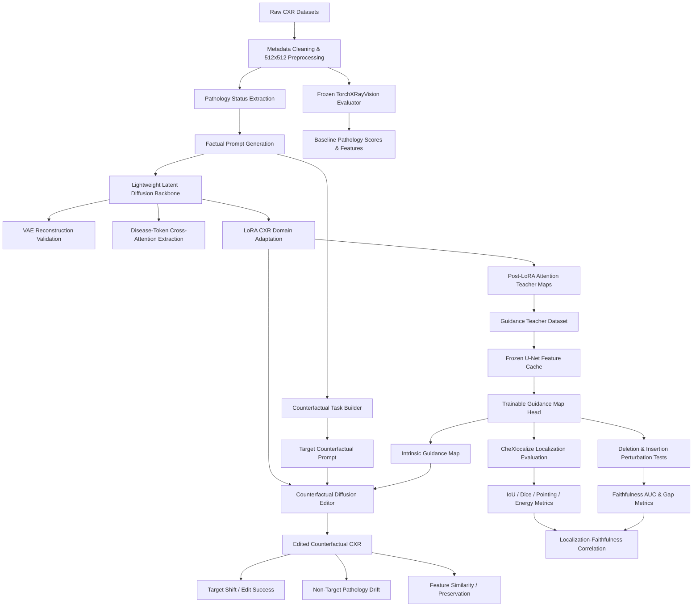

# Counterfactual Diffusion with Intrinsic Explanations for Causally Reliable Medical Image Editing

<p align="center">
  <strong>An end-to-end research pipeline for pathology-aware counterfactual chest X-ray editing with lightweight latent diffusion, LoRA adaptation, intrinsic Guidance Maps, and clinically oriented evaluation.</strong>
</p>

<p align="center">
  
  
  
  
  
</p>

---

## Overview

This repository implements a multi-stage research framework for **counterfactual medical image editing with intrinsic explanations**. The central objective is not merely to generate a visually plausible chest X-ray, but to perform a **targeted pathology edit** while simultaneously producing an auditable spatial explanation of **where the model acts** and evaluating whether that explanation is both **localized** and **functionally faithful**.

The pipeline focuses on four thoracic findings:

| Target pathology | Counterfactual operations |
| ---------------- | ------------------------- |
| Pleural Effusion | Insert / Remove           |
| Cardiomegaly     | Insert / Remove           |
| Edema            | Insert / Remove           |
| Consolidation    | Insert / Remove           |

Given a source CXR and its pathology-aware prompt, the system constructs a target counterfactual prompt by changing one disease state at a time. A lightweight latent diffusion model is adapted to the chest X-ray domain with **LoRA**, disease-token cross-attention is used to create teacher maps, and a dedicated **Guidance Map Head** learns to predict intrinsic spatial guidance. The resulting map is then used during counterfactual editing to encourage localized changes and preserve non-target anatomy.

> **Research goal:** move from “the model changed the image” toward “the model changed the intended pathology, preserved unrelated content, and exposed a measurable spatial rationale for the edit.”

---

## Key Contributions

* **Pathology-controlled counterfactual prompting** that flips one target disease state while preserving the remaining disease context.
* **Lightweight diffusion adaptation** using LoRA rather than full-model fine-tuning.
* **Disease-token cross-attention teacher maps** extracted from the diffusion U-Net.
* **Trainable intrinsic Guidance Map Head** supervised by post-LoRA teacher maps.
* **Guidance-masked counterfactual editing** for spatially focused insert/remove operations.
* **Frozen pathology-aware evaluation** using TorchXRayVision.
* **Non-target drift and representation-preservation analysis** to detect unintended changes.
* **CheXlocalize-based spatial validation** against pathology localization annotations.
* **Deletion/insertion faithfulness testing** to measure whether explanation regions causally affect pathology scores.
* **Localization–faithfulness correlation analysis** for thesis-level result consolidation.

---

## System Architecture



---

## End-to-End Research Pipeline

The implementation is organized as a **12-phase sequential workflow**. Each phase consumes artifacts produced by earlier phases and writes reproducible metadata, checkpoints, visualizations, or manifests.

| Phase                                      | Purpose                                                                                                                         | Main outputs                                                                           |
| ------------------------------------------ | ------------------------------------------------------------------------------------------------------------------------------- | -------------------------------------------------------------------------------------- |
| **1. Data & Prompt Preparation**           | Download datasets, clean metadata, build factual prompts, create insert/remove tasks, preprocess CXRs to 512×512                | Clean CSVs, debug subsets, edit-task tables, processed images, manifest                |
| **2. Frozen CXR Evaluator**                | Establish pathology-aware baseline predictions and medical feature embeddings with TorchXRayVision                              | XRV predictions, feature arrays, label sanity metrics, reusable evaluator              |
| **3. Diffusion & VAE Validation**          | Load lightweight diffusion backbone, test VAE reconstruction quality and pathology stability, generate pre-finetuning baselines | Reconstruction metrics, XRV stability metrics, baseline generations, VAE utilities     |
| **4. Attention Teacher Extraction**        | Capture U-Net cross-attention and aggregate disease-token maps                                                                  | Teacher heatmaps, overlays, `.npy` maps, tokenization diagnostics, attention utilities |
| **5. LoRA Domain Adaptation**              | Adapt the diffusion U-Net to CheXpert CXRs while freezing VAE, text encoder, and base weights                                   | LoRA weights, training logs, sample generations, XRV sanity checks                     |
| **6. Post-LoRA Teacher Dataset**           | Generate disease-token maps after CXR adaptation and prepare train/validation supervision for the Guidance Head                 | Teacher-map dataset, train/val splits, previews, reusable dataset module               |
| **7. Guidance Map Head Training**          | Cache frozen U-Net features and train a dedicated spatial prediction head                                                       | Feature cache, trained Guidance Head checkpoints, validation predictions and metrics   |
| **8. Counterfactual Editing**              | Perform insert/remove edits using target prompts and trained Guidance Maps                                                      | Edited CXRs, source/edited probabilities, edit metrics, group summaries, visual grids  |
| **9. Strength Sweep & Baselines**          | Compare multiple guidance/mask settings against prompt-only editing                                                             | Configuration benchmark, best-config summaries, prompt-only comparison grid            |
| **10. Localization Evaluation**            | Evaluate predicted Guidance Maps against CheXlocalize annotations                                                               | Per-case metrics, threshold sweeps, disease summaries, qualitative overlays            |
| **11. Explanation Faithfulness**           | Run deletion/insertion perturbation tests to measure functional importance of explanation regions                               | Curves, per-case AUC metrics, pairwise comparisons, summary tables                     |
| **12. Localization–Faithfulness Analysis** | Merge localization and faithfulness results and analyze their relationship                                                      | Merged analysis table and overall Pearson/Spearman correlation results                 |

> **Current implementation note:** the uploaded research script reaches Phase 12 overall localization–faithfulness correlation analysis. The Phase 12 directory structure anticipates further tables, figures, and report consolidation, but the current script ends after the overall correlation stage.

---

## Core Methodology

### 1. Controlled Factual Prompts

CheXpert labels are normalized into four states:

* `present`
* `absent`
* `uncertain`
* `not mentioned`

A factual prompt follows a controlled template such as:

```text
frontal chest x-ray, pleural effusion present, cardiomegaly absent,
edema uncertain, consolidation not mentioned.
```

This controlled language reduces prompt variation and makes pathology edits explicit and reproducible.

### 2. Counterfactual Task Construction

For every eligible frontal image, the pipeline changes **one disease at a time**:

```text
present -> absent  = remove pathology
absent  -> present = insert pathology
```

All other monitored disease states remain unchanged in the target prompt. This produces structured edit tasks containing:

```text
source image
source prompt
target disease
operation: insert | remove
target counterfactual prompt
source disease state
```

### 3. Lightweight Diffusion Backbone

The primary diffusion model is:

```text
nota-ai/bk-sdm-small
```

with fallback support for:

```text
segmind/tiny-sd
```

The pipeline first validates the backbone before training by testing:

* VAE encode/decode behavior on CXRs
* reconstruction quality
* pathology-score stability after reconstruction
* baseline text-to-image generation before domain adaptation

### 4. LoRA-Based CXR Adaptation

The diffusion model is adapted to the CXR domain by training LoRA adapters in U-Net attention layers.

```text
VAE          -> frozen
Text encoder -> frozen
Base U-Net   -> frozen
LoRA weights -> trainable
```

Default research configuration in the current script includes:

```text
Training subset: 2,000 CheXpert frontal CXRs
LoRA rank:       8
Max train steps: 2,500
Resolution:      512 x 512
```

The design keeps training lightweight while retaining the pretrained generative backbone.

### 5. Disease-Token Attention Teacher Maps

The system instruments diffusion cross-attention processors and records attention associated with disease-specific tokens. These signals are aggregated into spatial teacher maps.

Teacher-map generation is performed both:

* before LoRA adaptation, to verify extraction behavior; and
* after LoRA adaptation, to create CXR-domain supervision for the Guidance Map Head.

Outputs include:

```text
source image
teacher heatmap
source + heatmap overlay
raw teacher map (.npy)
coverage and extraction metrics
```

### 6. Intrinsic Guidance Map Head

A dedicated trainable head learns to predict pathology-relevant spatial maps from cached frozen U-Net features.

The current Phase 7 configuration uses:

```text
Feature timesteps:      5
Hidden channels:        128
Dropout:                0.05
Training steps:         600
Learning rate:          3e-4
Mixed precision:        fp16
```

The optimization objective combines multiple spatial losses:

```text
BCE weight:   1.00
Dice weight:  1.00
MAE weight:   0.50
Mass weight:  0.05
TV weight:    0.01
```

This encourages overlap with teacher maps while controlling noise, spatial mass, and map smoothness.

### 7. Guidance-Masked Counterfactual Editing

At edit time, the pipeline combines:

* source CXR
* target counterfactual prompt
* trained Guidance Map
* diffusion inversion/editing process
* operation-specific insert/remove behavior

The objective is to increase the intended pathology evidence for insertion tasks or decrease it for removal tasks while limiting collateral changes.

---

## Datasets

| Dataset                        | Role in the pipeline                                                                                                        |
| ------------------------------ | --------------------------------------------------------------------------------------------------------------------------- |
| **CheXpert**                   | Main CXR data source, pathology labels, prompt generation, edit-task construction, LoRA adaptation, evaluator sanity checks |
| **Indiana University / OpenI** | External smoke testing, report-linked qualitative samples, evaluator testing                                                |
| **CheXlocalize**               | Pixel-level pathology localization evaluation for predicted Guidance Maps                                                   |

The current data configuration references these Kaggle dataset slugs:

```text
raddar/chest-xrays-indiana-university
ashery/chexpert
snikhilrao/chexlocalize-dataset
```

### Data Availability

Medical datasets are **not redistributed by this repository**. Users must obtain access under the original dataset terms, licenses, and usage requirements. The pipeline downloads configured datasets through the Kaggle API when credentials and access are available.

---

## Evaluation Framework

A major focus of this project is evaluation beyond visual realism.

### Pathology-Aware Evaluation

The project uses a frozen TorchXRayVision DenseNet evaluator, preferring:

```text
densenet121-res224-all
```

with compatibility fallback to:

```text
all
```

The internal mapping for target tasks is:

| Project pathology | XRV output    |
| ----------------- | ------------- |
| Pleural Effusion  | Effusion      |
| Cardiomegaly      | Cardiomegaly  |
| Edema             | Edema         |
| Consolidation     | Consolidation |

### Counterfactual Editing Metrics

The implementation measures:

* **Target probability shift** — whether the desired pathology score moves in the intended direction.
* **Edit success** — threshold crossing and/or minimum target-score change.
* **Non-target pathology drift** — unintended changes in other monitored disease scores.
* **Feature similarity** — preservation of medical representations between source and edited images.
* **Group-wise performance** — breakdown by disease and insert/remove operation.
* **Configuration sensitivity** — effect of guidance strength and mask settings.
* **Prompt-only baseline comparison** — tests whether intrinsic spatial guidance improves targeted preservation.

### Localization Metrics

CheXlocalize evaluation includes threshold sweeps and per-case metrics such as:

* Intersection over Union (**IoU**)
* **Dice** score
* Precision
* Recall
* **Pointing-game hit**
* **Energy inside ground truth**
* Ground-truth area fraction

### Explanation Faithfulness Metrics

The project evaluates whether important map regions actually influence the pathology score through deletion and insertion tests.

Key outputs include:

* normalized deletion AUC
* normalized insertion AUC
* faithfulness gap
* deletion drop at 50%
* insertion gain at 50%
* raw deletion/insertion AUC
* pairwise comparison between explanation-map methods

### Localization–Faithfulness Relationship

Phase 12 merges localization and faithfulness results and computes:

* Pearson correlation
* Spearman rank correlation
* p-values
* expected relationship direction for each metric pairing

This directly studies whether a spatially accurate explanation is also functionally important to the model.

---

## Project Structure

The current implementation is a large Colab-oriented research script. During execution it builds the following artifact structure:

```text
/content/cxr_thesis/
├── raw/
│   ├── iu/
│   ├── chexpert/
│   └── chexlocalize/
│
├── processed/
│   ├── chexpert_512_debug/
│   ├── iu_512_debug/
│   ├── phase6_guidance_teacher_maps/
│   └── phase7_guidance_features/
│
├── metadata/
│   ├── chexpert_train_prompts_*.csv
│   ├── chexpert_train_edit_tasks_*.csv
│   ├── phase1_manifest.json
│   ├── phase2_*.csv
│   ├── phase3_*.csv
│   ├── phase4_*.csv
│   ├── phase5_*.csv
│   ├── phase6_*.csv
│   ├── phase7_*.csv
│   ├── phase8_*.csv
│   ├── phase9_*.csv
│   ├── phase10_*.csv
│   ├── phase11_*.csv
│   └── phase12_*.csv
│
├── features/
│   └── *.npy
│
├── checkpoints/
│   ├── phase5_lora/
│   └── phase7_guidance_head/
│
├── results/
│   ├── phase3/
│   ├── phase4/
│   ├── phase5/
│   ├── phase7/
│   ├── phase8/
│   ├── phase9/
│   ├── phase10/
│   ├── phase11/
│   └── phase12/
│
└── src/
    ├── evaluation/
    │   └── xrv_evaluator.py
    ├── diffusion/
    │   └── vae_utils.py
    ├── attention/
    │   └── attention_utils.py
    ├── training/
    │   └── train_lora_cxr.py
    └── guidance/
        ├── guidance_dataset.py
        └── additional generated guidance utilities
```

Google Drive is used as a persistent mirror under:

```text
/content/drive/MyDrive/thesis_cxr_diffusion/
```

---

## Getting Started

### Prerequisites

Recommended environment:

* Google Colab with GPU runtime
* Python 3.10+
* CUDA-capable GPU
* Google Drive access for persistent artifacts
* Kaggle account and API token
* Sufficient storage for medical image datasets and generated checkpoints

Major packages used across the phases include:

```text
torch
torchvision
diffusers
transformers
accelerate
peft
safetensors
torchxrayvision
scikit-image
scikit-learn
pandas
numpy
Pillow
opencv-python
pydicom
pyarrow
matplotlib
tqdm
kaggle
```

### Important Execution Note

The current file is a **Google Colab notebook export saved as a `.py` file**. It contains notebook shell commands such as:

```python
!nvidia-smi
!pip install ...
```

and Colab-specific APIs such as:

```python
from google.colab import drive, files
```

Therefore, do **not** expect the unmodified file to run as a conventional script with:

```bash
python "diffusion based explainability.py"
```

Recommended usage is to execute the project in its original notebook/Colab form, or first refactor the exported file into notebook cells or standalone modules.

### 1. Configure a GPU Runtime

In Google Colab:

```text
Runtime -> Change runtime type -> GPU
```

The pipeline performs explicit CUDA and `nvidia-smi` checks.

### 2. Prepare Kaggle Credentials

Download `kaggle.json` from your Kaggle account and upload it when the pipeline prompts you.

The script stores it at:

```text
~/.kaggle/kaggle.json
```

with restrictive file permissions.

### 3. Mount Google Drive

The pipeline mounts Drive and creates:

```text
/content/drive/MyDrive/thesis_cxr_diffusion/
```

for metadata, checkpoints, processed archives, source utilities, features, and results.

### 4. Run Phases Sequentially

Execute the research workflow in order:

```text
Phase 1  -> data, prompts, preprocessing
Phase 2  -> frozen CXR evaluator
Phase 3  -> diffusion/VAE validation
Phase 4  -> cross-attention teacher maps
Phase 5  -> LoRA adaptation
Phase 6  -> post-LoRA teacher dataset
Phase 7  -> Guidance Map Head training
Phase 8  -> counterfactual editing
Phase 9  -> strength sweep and baselines
Phase 10 -> CheXlocalize localization
Phase 11 -> deletion/insertion faithfulness
Phase 12 -> localization-faithfulness analysis
```

Each phase validates required upstream artifacts before proceeding.

---

## Default Reproducibility Settings

| Setting                               | Default                           |
| ------------------------------------- | --------------------------------- |
| Random seed                           | `42`                              |
| CXR preprocessing resolution          | `512 × 512`                       |
| XRV evaluator resolution              | `224 × 224`                       |
| CheXpert domain debug subset          | `2,000` images                    |
| Edit-task sample cap                  | `250` per disease-operation group |
| IU/OpenI smoke-test subset            | `300` images                      |
| Phase 5 LoRA rank                     | `8`                               |
| Phase 5 max train steps               | `2,500`                           |
| Phase 7 feature timesteps             | `5`                               |
| Phase 7 Guidance Head steps           | `600`                             |
| Phase 7 Guidance Head hidden channels | `128`                             |
| Phase 7 learning rate                 | `3e-4`                            |

The pipeline writes manifest files to preserve phase-specific configuration and artifact paths.

---

## Example Counterfactual Task

### Source state

```text
frontal chest x-ray,
pleural effusion present,
cardiomegaly absent,
edema absent,
consolidation not mentioned.
```

### Target edit

```text
Target disease: Pleural Effusion
Operation: remove
```

### Counterfactual target prompt

```text
frontal chest x-ray,
pleural effusion absent,
cardiomegaly absent,
edema absent,
consolidation not mentioned.
```

### Desired behavior

The edited CXR should:

1. reduce evaluator evidence for pleural effusion;
2. preserve cardiomegaly, edema, and consolidation evidence as much as possible;
3. maintain high source/edited medical feature similarity outside the intended change;
4. expose a Guidance Map concentrated on a pathology-relevant region; and
5. demonstrate measurable deletion/insertion faithfulness.

---

## Research Outputs

Depending on the completed phase, the pipeline produces:

* cleaned and merged metadata
* factual prompts
* counterfactual edit-task tables
* balanced train/validation subsets
* preprocessed 512×512 CXRs
* TorchXRayVision predictions
* medical feature embeddings
* VAE source/reconstruction/difference images
* PSNR/SSIM reconstruction diagnostics
* baseline diffusion generations
* disease-token attention maps
* LoRA checkpoints
* post-LoRA teacher maps
* frozen U-Net feature caches
* Guidance Head checkpoints
* predicted intrinsic Guidance Maps
* counterfactual edited CXRs
* target-shift and non-target-drift metrics
* baseline sweep comparisons
* CheXlocalize localization scores
* deletion/insertion faithfulness curves
* localization–faithfulness correlation tables
* JSON phase manifests

---

## Suggested GitHub Repository Organization

For long-term maintainability, the current notebook-export workflow can be modularized into:

```text
.
├── README.md
├── notebooks/
│   └── diffusion_based_explainability.ipynb
├── src/
│   ├── data/
│   ├── diffusion/
│   ├── attention/
│   ├── guidance/
│   ├── evaluation/
│   └── training/
├── configs/
│   ├── phase5_lora.yaml
│   ├── phase7_guidance.yaml
│   └── editing.yaml
├── scripts/
│   ├── train_lora.py
│   ├── train_guidance_head.py
│   ├── run_counterfactual_edits.py
│   └── evaluate_faithfulness.py
├── tests/
├── .gitignore
└── requirements.txt
```

This is a recommended future organization; the current uploaded implementation remains a sequential Colab-oriented research pipeline.

---

## Reproducibility and Artifact Management

The project is designed around explicit intermediate artifacts rather than opaque end-to-end execution. Important characteristics include:

* fixed random seed (`42`)
* phase-specific validation checks
* CSV metadata at each stage
* reusable Python modules generated from notebook code
* `.npy` feature and map artifacts
* checkpoint persistence
* local runtime + Google Drive recovery
* per-phase JSON manifests
* balanced disease/operation sampling
* deduplication of evaluator inference where possible

This design makes it easier to inspect failures, rerun individual stages, and audit the lineage of final results.

---

## Limitations

This project is an active research prototype and has important limitations:

* Counterfactual realism does not guarantee clinical validity.
* Frozen pathology evaluators may contain dataset bias and domain shift.
* A change in evaluator score is not equivalent to verified disease progression or resolution.
* Cross-attention maps are not automatically causal explanations; this is why the project adds explicit faithfulness tests.
* Localization performance can depend strongly on threshold selection and annotation characteristics.
* The current workflow is computationally expensive and sequentially dependent.
* The present implementation is Colab-centric and should be modularized for production-scale reproducibility.
* Phase 12 currently implements the merged analysis and overall correlation stage; broader final reporting remains an extension point.

---

## Medical and Ethical Disclaimer

> **This repository is for research and educational use only. It is not a medical device and must not be used for diagnosis, treatment planning, patient management, or any other clinical decision.**

Generated or edited medical images may be incorrect, misleading, or clinically implausible. Any medical interpretation requires qualified clinical experts, appropriate validation, and compliance with relevant institutional, ethical, privacy, and regulatory requirements.

---

## Author

**Kamran Ullah Afaq**
Machine Learning / AI Engineer and Researcher
Research interests: Computer Vision, Medical Imaging, Diffusion Models, Generative AI, Explainable AI, and Multimodal Learning

---

## Citation

A formal publication citation has not yet been added. For academic use, cite the associated thesis or publication once available.

A temporary software citation can follow this format:

```bibtex
@software{afaq_counterfactual_diffusion,
  author  = {Kamran Ullah Afaq},
  title   = {Counterfactual Diffusion with Intrinsic Explanations for Causally Reliable Medical Image Editing},
  year    = {2026},
  note    = {Research software and experimental pipeline}
}
```

---

## Acknowledgements

This research pipeline builds on the open-source machine learning ecosystem, including:

* PyTorch
* Hugging Face Diffusers and Transformers
* PEFT / LoRA tooling
* TorchXRayVision
* CheXpert
* Indiana University / OpenI chest X-ray data
* CheXlocalize
* BK-SDM
* the broader medical imaging and explainable AI research communities

Please consult and respect the original licenses, dataset access terms, model cards, and citation requirements for all third-party resources.

---

<p align="center">
  <strong>Targeted editing. Intrinsic guidance. Measurable faithfulness.</strong>
</p>
